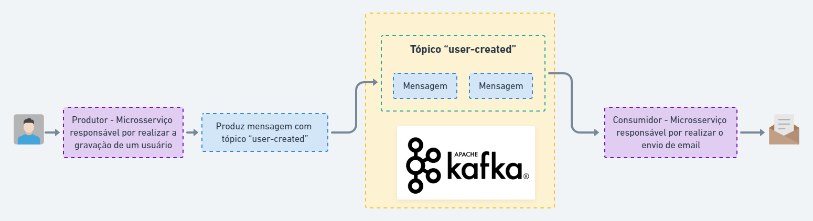

<br />
<div align="center">
  <h1 align="center">Projeto simples utilizando Kafka</h1>
</div>
<br />

# 💻 Sobre o Projeto
Esse projeto é a simulação de um sistema simples de cadastro de usuário, onde foi criado dois microserviços, sendo a comunicação entre eles feita através do <b>Kafka</b>: 

 1) Microserviço responsável por realizar a gravação de um usuário.
 2) Microserviço responsável por realizar a simulação de um envio de email com um código de confirmação para o emails que foram cadastrados. 

<br />
<br />

# 🛣 Fluxo


<br />
<br />

# 👨‍💻 Recursos Utilizados
<li>Node
<li>Kafka
<li>Express
<li>Sequelize
<li>Postgres
<li>Nodemailer

<br />
<br />

# ❗ Necessário para rodar o projeto
<li>Docker e Docker Compose

<br />
<br />

# ✅ Passos para rodar o projeto
1. Clonar o repositório
  ```sh
   git clone https://github.com/kaynansc/kafka_node
  ```
2. Rodar containers
  ```sh
   docker-compose up -d
  ```
3. Acompanhar logs (Verificar através dos logs se o "envio" de email ocorreu)
  ```sh
   docker logs -f microservice_email
  ```

<br />
<br />

# 🔑 Como usar
Com os containers já rodando, o projeto possui apenas uma rota:

- <b>POST - http://localhost:3000/users</b>
```sh
   curl --location --request POST 'http://localhost:3000/users' \
   --header 'Content-Type: application/json' \
   --data-raw '{
     "name": "Test",
     "email": "teste@test.com",
     "age": 18
   }'
  ```
Essa rota bate no microserviço responsável por realizar a gravação de um usuário e depois produz uma mensagem para o Kafka com o tópico de "user-created" com as informações do usuário criado. 

O microserviço responsável por enviar email já está aguardando mensagens com o tópico "user-created", sendo assim, quando chegar uma mensagem desse tópico, automaticamente é enviado um email com um código de confirmação para o email que foi cadastrado. 

Acompanhar logs (Verificar através dos logs se o "envio" de email ocorreu)
  ```sh
   docker logs -f microservice_email
  ```

